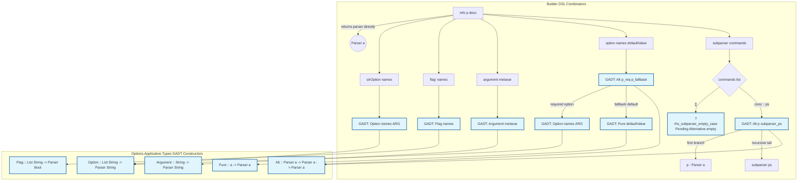

# Function Call Workflow Diagram

This diagram illustrates how the DSL combinators in `Options.Applicative.Builder` map down to the core GADT constructors defined in `Options.Applicative.Types`.

## Overview
Top-level wrapper functions dispatch parsing tasks, while builder functions construct specific primitive parsers. All execution paths eventually resolve into the core `Parser` GADT (`Flag`, `Option`, `Argument`, `Alt`, `Pure`).

## Call Flow Explanation
1. **`info p desc`**: Currently acts as an identity wrapper for the parser `p`. The `desc` string is reserved for future help-generation integration (Phase 2).
2. **`subparser commands`**: Recursively processes a list of named subcommands (`(String, Parser a)`). It chains them together using the `Alt` (Alternative) combinator, creating an N-ary choice between subparsers. The empty base case is currently pending implementation via the `Alternative` instance for `Parser`.
3. **`strOption`, `flag'`, `argument`**: Direct mappings to their respective core GADT constructors (`Option`, `Flag`, `Argument`). They handle primitive CLI inputs.
4. **`option names defaultValue`**: Constructs a fallback mechanism by combining an `Option` parser and a `Pure` parser using the `Alt` combinator. If the option is present on the CLI, it parses; otherwise, it falls back to the default value.

## Future Phase 2 Expansions
- **Modifiers:** Functions like `long`, `short`, and `help` will intercept calls between Builder and Core Types to attach metadata before GADT construction.
- **Help Generation:** The `desc` argument in `info` will branch out to the `Help.idr` module for usage text rendering.
